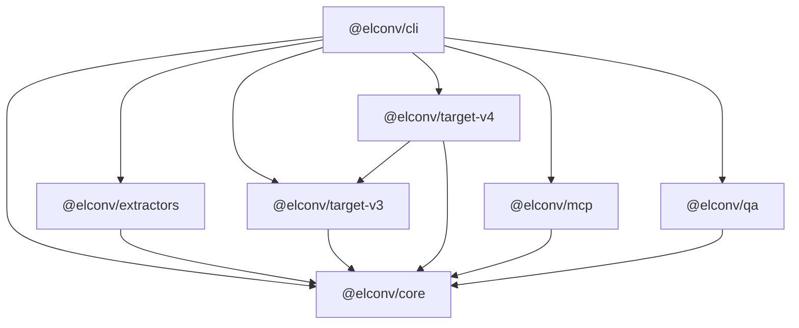

# Architecture

## Package dependency graph

## Pipeline stages

## Extraction stack

1. **Playwright** — live DOM, hydration wait, lazy scroll
2. **Computed styles** — curated CSS walk for widget mapping
3. **Section detector** — layout regions
4. **Font / asset pipeline** — rate-limited downloads + manifest
5. **Recon** — SPA framework + mutation observer

## Isolation rules

- V3 and V4 trees are **branded** (`__v3Brand` / `__v4Brand`)
- Contamination guards reject cross-target widgets
- Deploy strategy chooses full vs chunked by payload size
